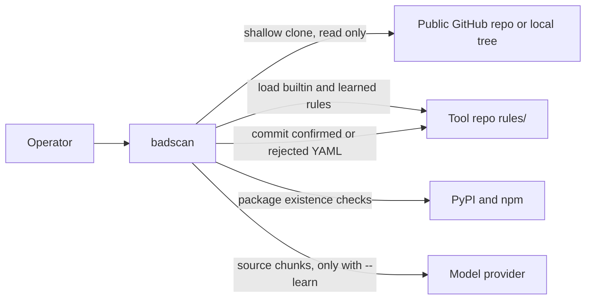
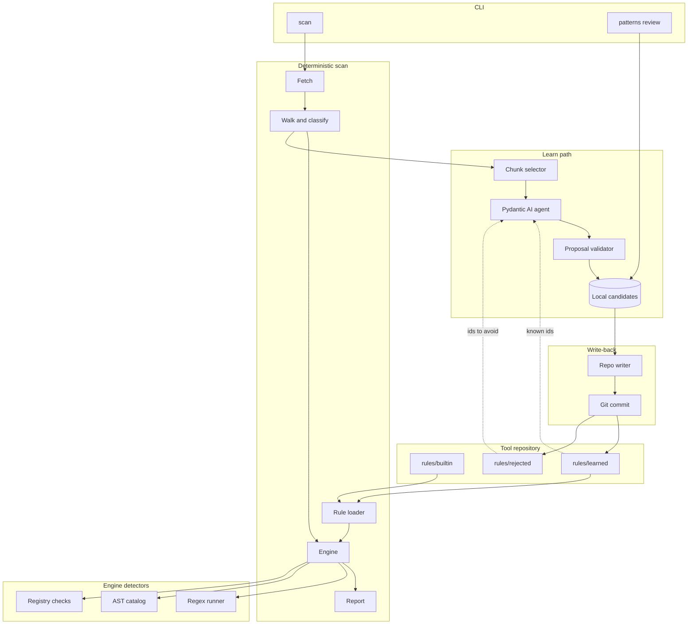
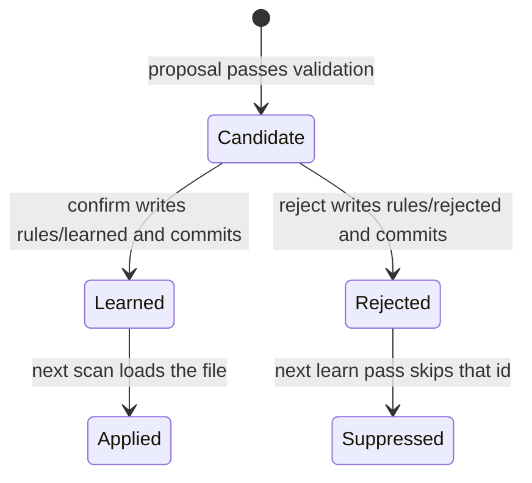
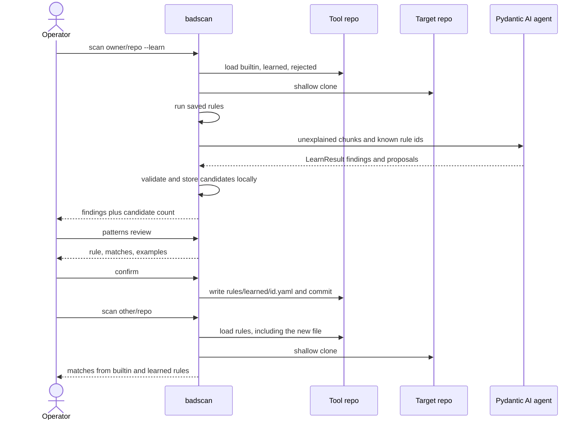

# Architecture

badscan is a static scanner for public GitHub repositories and local trees. It flags bad code patterns that show up when generated code is merged without review: pasted assistant prose, stubbed implementations, placeholder secrets, insecure cookbook snippets, and dependencies that do not exist on the public registry.

A scan reports evidence and a confidence score. The tool does not claim that a file was written by a model.

The pattern library lives in this repository. A scan loads saved rules and applies them locally. An optional AI pass proposes new rules. After confirmation, the tool writes the rule back into this repo and commits it, so later scans and later installs use it.

## System context



The tool repository is the pattern library. Target code is parsed and never executed. Target code leaves the machine only during `--learn`. That path is a Pydantic AI agent, so switching models means changing a `provider:name` string. The agent, its instructions, and the output schema stay the same.

## Components



| Component | Responsibility |
| --- | --- |
| CLI | `scan` and `patterns review`. Parses targets, flags, and exit codes. |
| Fetch | Reads a local directory, or shallow-clones one public GitHub repository (`git clone --depth 1`). |
| Walk | Inventories files, skips vendored and generated trees, and classifies each file as source, test, config, or docs. |
| Rule loader | Reads `rules/builtin/` and `rules/learned/` into pattern objects. Reads `rules/rejected/` only as a suppression list for the learn path. |
| Engine | Runs every loaded pattern over the file inventory and emits findings. |
| Regex runner | Applies textual patterns. Available in phase 1. |
| AST catalog | Applies a fixed set of structural checks. The model selects a catalog id. It does not submit code to execute. Phase 2. |
| Registry checks | Asks PyPI and npm whether a manifest dependency exists. Builtin detectors, because they need network lookups. Phase 2. |
| Chunk selector | Chooses source chunks the saved library did not already explain with a high-confidence match. Used only with `--learn`. |
| Pydantic AI agent | Sends those chunks to the configured model and returns a typed `LearnResult` (findings plus pattern proposals). The model is a `provider:name` string, so the same agent runs against any provider Pydantic AI supports. |
| Proposal validator | Compiles each proposed regex, checks the match example, and checks the reject example. Invalid proposals are kept with the finding and are not added to the library. |
| Local candidates | Holds proposals that passed validation until the operator reviews them. This directory is outside the git repo. |
| Repo writer | On confirm or reject, writes one YAML file into `rules/learned/` or `rules/rejected/` and commits it on the current branch. |
| Report | Renders findings as text or JSON. |

`scan` never calls the model. `--learn` adds the learn path. `patterns review` is the only way a candidate becomes a file under `rules/`.

## Pattern lifecycle



A proposal becomes a candidate only after the regex compiles, the match example matches, and the reject example does not. Confirm and reject each create one commit on the tool checkout. Push is a separate `patterns push`, so a confirm stays local until it is published.

Confirm runs inside a git checkout of this tool. Pass `--repo` when the shell is in another directory. The writer does not update an installed copy under `site-packages`.

## Scan, learn, and confirm



Reject follows the same write path into `rules/rejected/`. A later `--learn` pass sends those ids with the learned ids, so the model does not propose the same rule again.

A scan without `--learn` stops after the saved rules run. That path is deterministic and does not call the model.

## Learn agent

Phase 2 implements `learn/agent.py` with Pydantic AI. One agent owns the instructions and the output schema. The model is injected at run time from `BADSCAN_MODEL`.

```python
from pydantic_ai import Agent

agent = Agent(
    output_type=LearnResult,
    instructions=(
        "Propose reusable bad-code patterns for generated code "
        "that was merged without review. Return findings and rules."
    ),
)

result = await agent.run(prompt, model=os.environ["BADSCAN_MODEL"])
proposals = result.output  # LearnResult
```

`LearnResult` is a Pydantic model with two lists: findings for this scan, and pattern proposals in the YAML schema above. Pydantic AI validates the model response into that type. The proposal validator then checks that each regex compiles and that the examples behave as claimed.

`BADSCAN_MODEL` uses Pydantic AI's `provider:name` form. These are the same agent:

- `openai:gpt-4.1`
- `anthropic:claude-sonnet-4-5`
- `google-gla:gemini-2.5-flash`

Provider API keys stay in the environment variables that provider already uses. Tests pass `TestModel` instead of `BADSCAN_MODEL`, so a fixture run creates a candidate without calling a provider.

## Repository layout

```
badscan/
  cli.py                 # scan, patterns review, patterns push
  orchestrator.py        # scan flow and learn flow
  models.py              # Finding, Pattern, LearnResult, ScanResult
  fetch/
    local.py
    github.py            # shallow clone of one public repo
  walk.py                # inventory, classify, size caps
  library/
    loader.py            # builtin, learned, rejected
    schema.py            # pattern model and YAML parse
  engine/
    runner.py            # dispatch on detect.type
    regex.py
    ast_catalog.py       # phase 2
    registry.py          # phase 2, PyPI and npm
  learn/
    select.py
    agent.py             # Pydantic AI agent, output_type=LearnResult
    validate.py
    candidates.py        # local store, outside git
  review/
    prompt.py
    repo_writer.py       # write YAML and git commit
  report/
    text.py
    json.py
rules/
  builtin/               # seed rules, one YAML file per pattern
  learned/               # confirmed patterns, committed
  rejected/              # suppressed proposals, committed
tests/
  fixtures/              # synthetic snippets, no live GitHub
```

Stack: Python 3.11, Typer, httpx, PyYAML, Pydantic, Pydantic AI, pathspec, and the stdlib `ast` module. Tests use pytest. Linting uses Ruff. License is MIT.

## Pattern schema

Each file under `rules/builtin/` and `rules/learned/` is one pattern. The engine executes the pattern without calling the model.

```yaml
id: learned.except-log-and-continue
status: confirmed
severity: medium
confidence: 0.72
category: error-handling
languages: [python]
message: Exception handler logs and continues, so the failure disappears.
detect:
  type: regex
  regex: '(?s)except\s+Exception\s*:\s*\n\s*(logger|logging)\.\w+\('
  exclude: ["**/test/**", "**/docs/**"]
examples:
  match: |
    except Exception:
        logger.error("failed")
  reject: |
    except ValueError:
        logger.error("bad value")
        raise
origin:
  model: <model id>
  repo: owner/name
  confirmed_at: 2026-10-06
```

`detect.type` is `regex` or `ast`. An `ast` pattern names an id from the catalog and may pass parameters. Builtin seed rules use the same schema. Registry checks are Python detectors in `engine/registry.py`, because a YAML rule cannot express an HTTP lookup.

A finding produced by a match contains:

- `rule_id`, `category`, `severity`, `confidence`
- `path`, line range, snippet
- `message`

The committed YAML stores the rule, both examples, and origin metadata. Examples are short snippets. The writer does not commit the scanned tree.

## Command surface

```
badscan scan owner/repo
badscan scan ./path
badscan scan https://github.com/owner/repo --format json -o report.json
badscan scan owner/repo --learn
badscan patterns review
badscan patterns push
```

Flags for `scan`: `--min-severity`, `--min-confidence`, `--include-tests`, `--no-network`, `--max-files`, `--learn`, `--repo`, `--format`, `-o`.

Exit codes: `0` when nothing meets the threshold, `1` when a finding does, `2` on usage or fetch errors.

`--learn` stays off unless `BADSCAN_MODEL` is set. That value is a Pydantic AI model string, such as `openai:gpt-4.1` or `anthropic:claude-sonnet-4-5`. The provider reads its own API key (`OPENAI_API_KEY`, `ANTHROPIC_API_KEY`, and the keys documented for the other providers). `GITHUB_TOKEN` is optional and raises GitHub API rate limits. Cloning a public repository does not require a token.

## Boundaries

- Fetch uses the GitHub API and `git clone` for public repositories. The scanner does not scrape the website.
- Submodules stay off unless the operator opts in.
- File count and file size are capped. Vendored directories (`node_modules`, `vendor`, `dist`) and `.git` are skipped.
- Tests and docs are skipped unless `--include-tests` is set.
- The process never installs, imports, or executes code from the target.
- `--learn` is the only path that sends source to a model provider, through the Pydantic AI agent. The README for the implementation must say that plainly.
- One pattern is one file, so two confirms of different rules do not collide.
- Candidates live in the local data directory until confirm or reject. Unconfirmed model output is not committed.

## Three-phase approach

Each phase leaves a usable tool. Later phases add detectors and the learn loop. They do not replace the scan path from phase 1.

### Phase 1 — Deterministic scan

Deliver a scanner that runs saved YAML rules against a local tree or one public repository.

- CLI `scan` for a local path, `owner/repo`, and a GitHub URL.
- Shallow clone, file walk, and ignore rules for vendored and generated files.
- Loader for `rules/builtin/` and `rules/learned/`.
- Regex engine with path excludes.
- Text and JSON reports, including the exit codes above.
- A small builtin set: assistant-residue phrases, stub bodies, placeholder secrets, and a handful of insecure defaults.
- Fixture tests that run on synthetic files and do not call GitHub.

Done when `badscan scan` on a fixture tree reports the seeded patterns and writes JSON that matches the finding schema. `rules/learned/` may be empty. The learn path is absent.

### Phase 2 — Learn, confirm, and deeper detectors

Deliver the loop that adds rules to this repository, plus the detectors that YAML regex cannot express.

- `--learn` selects unexplained source chunks and runs one Pydantic AI `Agent`. `output_type` is `LearnResult`, a Pydantic model with findings and pattern proposals. Instructions and the output schema stay fixed across models.
- The model comes from `BADSCAN_MODEL` (`provider:name`). Switching from OpenAI to Anthropic, Gemini, Groq, or another provider Pydantic AI ships is a change to that string.
- Tests drive the same agent with Pydantic AI's `TestModel`, so the learn path runs without a live provider.
- Candidates are stored locally. `patterns review` confirms or rejects each one.
- Confirm writes `rules/learned/<id>.yaml` and commits it. Reject writes `rules/rejected/<id>.yaml` and commits it.
- The next `scan` loads the new learned file with no model call.
- Python AST catalog: bare `except`, `eval` / `exec`, `subprocess` with `shell=True`, and `verify=False`.
- Builtin registry detectors for dependencies declared in Python and npm manifests. `--no-network` skips them.
- Duplicate detection against ids already in `learned/` and `rejected/`.

Done when a `--learn` run on a fixture produces a candidate, confirm commits a YAML file under `rules/learned/`, and a second scan matches that rule with the model disabled.

### Phase 3 — Publish and hunt

Deliver sharing of the library and scans across many public repositories. Hunt mode reuses the phase 1 scan path.

- `patterns push` pushes the tool branch that holds new learned or rejected commits.
- A GitHub Action runs the deterministic scan (no `--learn`) on this repository's fixtures and on a chosen target.
- Hunt mode accepts a GitHub repository search, scans each public repo up to a limit, and writes a markdown report.
- Hunt mode honors rate limits, caches clones, and can resume.

Done when a confirmed pattern can be pushed from the CLI, the Action runs the deterministic scan, and one hunt invocation scans multiple public repositories with the saved library.

## Out of scope

- An authorship classifier, or any label of "AI" or "human" on a file.
- General static analysis beyond this pattern library.
- Opening issues or pull requests on scanned repositories.
- Executing scanned code, including install hooks.
- Writing confirmed patterns into a per-user directory or into `site-packages`. The tool repo is the library.
